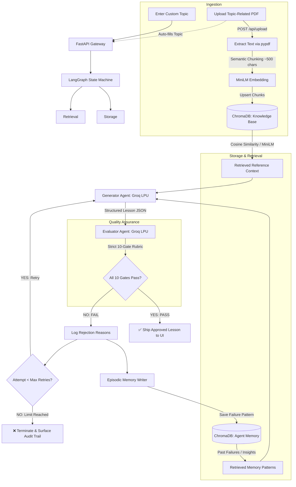

# 🎓 Self-Evaluating RAG Lesson Agent

[](https://fastapi.tiangolo.com)
[](https://github.com/langchain-ai/langgraph)
[](https://groq.com)
[](https://www.trychroma.com)
[](https://react.dev)
[](https://vitejs.dev)
[](https://www.python.org)

> An autonomous, closed-loop educational content generation system built for GenAI Engineering. It supports pre-indexed curriculum knowledge as well as **dynamic topic-related PDF uploads**, generates structured beginner-friendly lessons, strictly evaluates against 10 hard binary gates, logs failure patterns into persistent memory, and autonomously refines content until approved.

---

## 📌 Overview & Problem Statement

Standard LLM pipelines suffer from three critical shortcomings when creating educational content:
1. **Hallucinations and ungrounded facts** not anchored in authoritative source material.
2. **Cognitive overload** for beginners (unexplained technical jargon, non-sequential pedagogy).
3. **No self-correction mechanism** — single-shot prompting either fails silently or ships subpar content.

### 💡 The Solution: Self-Evaluating Agentic Loop
This system implements a production-grade **Ingest/Upload → Retrieve → Generate → Evaluate → Reflect & Learn → Regenerate → Ship** state machine:
- **Target Persona:** 12th-grade graduate with basic English proficiency and zero background in artificial intelligence.
- **Dynamic Curriculum & PDF Ingestion:** Works with pre-indexed curriculum notes or dynamic user-uploaded reference PDFs (auto-extracted, chunked, and embedded).
- **Strict Binary Evaluation:** 10 deterministic criteria. No partial credit. If even a single criterion fails, the lesson is rejected.
- **Reflection & Episodic Memory:** Rejections are summarized into actionable feedback and written to ChromaDB memory. Subsequent runs and retries query this memory to prevent recurring mistakes.
- **Termination Guarantee:** Enforces a hard retry limit ($\le 2$ retries) to guarantee state machine termination and prevent runaway execution costs.

---

## 🏗️ Architecture & Workflow



---

## 🎯 10-Gate Binary Rubric

Every candidate lesson is audited against **10 strict binary gates**. There is zero partial credit:

| # | Rubric Gate | Description & Criteria |
|---|---|---|
| 1 | **Accuracy** | All factual statements must strictly conform to verified computer science principles. |
| 2 | **Grounding** | All claims must be anchored exclusively in the retrieved reference documents. |
| 3 | **Beginner Language** | Uses simple English, short sentences, and eliminates unnecessary complexity. |
| 4 | **Jargon Explanation** | **Zero unexplained jargon.** Every technical term (e.g., *embeddings*, *chunks*, *vector database*) must be defined in plain terms upon first appearance. |
| 5 | **Explains What RAG Is** | Clear, intuitive definition of Retrieval-Augmented Generation. |
| 6 | **Explains Why RAG Matters** | Outlines real-world problems RAG solves (fresh knowledge, reduced hallucinations, private data access). |
| 7 | **Explains How RAG Works** | Sequential, step-by-step breakdown (Ingestion $\rightarrow$ Retrieval $\rightarrow$ Augmentation $\rightarrow$ Generation). |
| 8 | **Teaches by Example** | Features a concrete, relatable scenario contrasting outcomes **with** and **without** RAG. |
| 9 | **Coherent Teaching Flow** | Pedagogically logical progression: Intro $\rightarrow$ What $\rightarrow$ Why $\rightarrow$ How $\rightarrow$ Example $\rightarrow$ Summary $\rightarrow$ Quiz. |
| 10 | **Standalone Lesson** | Fully self-contained — no external prerequisites or missing context required. |

---

## 🧠 Key Agentic Features

### 1. Dynamic PDF Upload & Knowledge Ingestion
- In addition to pre-indexed data, learners and educators can upload arbitrary PDF course materials directly from the UI.
- The backend parses the PDF via `pypdf`, splits text into semantic chunks (~500 chars with overlap), generates local MiniLM embeddings, and indexes them into ChromaDB in real time.
- The suggested topic title is pre-filled, allowing instant lesson generation on custom documents.

### 2. Dual-Collection ChromaDB Architecture
- **`knowledge_base` Collection:** Vector store containing curriculum notes (Lewis et al. RAG paper, Microsoft Azure AI patterns) plus user-uploaded PDFs, with source metadata.
- **`agent_memory` Collection:** Persistent episodic memory storing past generation failures, rubric critiques, and targeted instructions for future retries.

### 3. Built-in Demo Error Injection
- Toggleable via the UI or API (`demo_error: true`).
- Injects an intentional technical term without defining it on Attempt 1.
- Allows interviewers and evaluators to see the agent **catch its own failure in real time**, log the rejection, store it in memory, and regenerate an approved version on Attempt 2.

### 4. Self-Healing JSON Engine
- Groq structured generation with automated error recovery.
- Automatic retry handlers and regex syntax repair to catch and heal edge-case LLM delimiter mistakes without crashing the API server.

---

## 📂 Project Structure

```text
edutech-bot/
├── backend/
│   ├── app/
│   │   ├── main.py            # FastAPI endpoints (/health, /api/upload, /api/generate)
│   │   ├── workflow.py        # LangGraph iterative generation/evaluation orchestrator
│   │   ├── agents.py          # Groq generator, evaluator, and memory reflection agents
│   │   ├── store.py           # ChromaDB client & SentenceTransformer embedding layer
│   │   └── config.py          # Environment settings (Groq, HF, Chroma paths)
│   ├── scripts/
│   │   └── ingest.py          # Data ingestion script to populate ChromaDB
│   ├── Dockerfile             # Container definition for backend service
│   ├── pyproject.toml         # Python packaging and dependencies
│   └── requirements.txt       # Pip requirements specification
├── frontend/
│   ├── src/
│   │   ├── main.tsx           # React UI with PDF upload, interactive generation & audit logs
│   │   ├── style.css          # Dark-mode dashboard styling
│   │   └── vite-env.d.ts      # Vite type declarations
│   ├── package.json           # Frontend dependencies (React, Vite, Lucide)
│   └── vite.config.ts         # Vite bundler configuration
├── data/
│   ├── rag_knowledge.json     # Curated source documents with metadata
│   └── chroma/                # Persistent vector database store
├── docs/
│   ├── SUBMISSION.md          # Project design decisions & trade-offs
│   ├── LOOM_SCRIPT.md         # Video walkthrough recording outline
│   ├── NOTION_DOCUMENTATION.txt   # Notion-ready documentation
│   └── GOOGLE_DOCS_DOCUMENTATION.txt # Google Docs-ready documentation
├── docker-compose.yml         # Full-stack container orchestration
├── .env.example               # Environment template
└── README.md                  # Project documentation
```

---

## 🚀 Quick Start & Run Commands

### Prerequisites
- **Python 3.11+**
- **Node.js 18+** & **npm**
- **Groq API Key** ([console.groq.com](https://console.groq.com))
- *(Optional)* **Hugging Face Access Token** for authenticated model downloads

---

### Step 1: Environment Setup

Clone the repository and copy the environment file:

```bash
# Clone repository
git clone https://github.com/your-username/edutech-bot.git
cd edutech-bot

# Copy environment template
cp .env.example .env
```

Edit `.env` and provide your credentials:

```env
GROQ_API_KEY=gsk_your_actual_groq_key_here
GROQ_MODEL=openai/gpt-oss-20b
MAX_RETRIES=2
CHROMA_PATH=./data/chroma
SQLITE_PATH=./data/runs.db
HF_TOKEN=your_optional_hf_token
```

---

### Step 2: Run the Backend

You can run the backend using either **`uv`** (recommended for ultra-fast sync) or standard **`pip`**.

#### Option A: Using `uv` (Recommended)
```bash
cd backend

# 1. Install dependencies
uv sync

# 2. Ingest the reference knowledge base into ChromaDB
uv run python scripts/ingest.py

# 3. Start the FastAPI development server
uv run uvicorn app.main:app --reload --port 8000
```

#### Option B: Using standard `venv` & `pip`
```bash
cd backend

# 1. Create and activate virtual environment
python -m venv .venv

# Windows (PowerShell):
.venv\Scripts\Activate.ps1
# macOS/Linux:
source .venv/bin/activate

# 2. Install dependencies
pip install -r requirements.txt

# 3. Ingest knowledge into ChromaDB
python scripts/ingest.py

# 4. Start the FastAPI server
uvicorn app.main:app --reload --port 8000
```

> The backend will be live at: **`http://localhost:8000`**  
> Health check endpoint: **`http://localhost:8000/health`**

---

### Step 3: Run the Frontend

Open a **new terminal window**:

```bash
cd frontend

# 1. Install dependencies
npm install

# 2. Start the Vite development server
npm run dev
```

> The web application will be accessible at: **`http://localhost:5173`**

---

### 🐳 Step 4: Alternative — Run with Docker Compose

To spin up the entire application (Backend + Vector Store + Frontend) with a single command:

```bash
docker compose up --build
```

- Frontend: **`http://localhost:5173`**
- Backend: **`http://localhost:8000`**

---

## 🧪 Testing the Agent & Verification

### 1. Standard Generation Test
1. Navigate to **`http://localhost:5173`** in your browser.
2. Enter the topic: `Introduction to RAG`.
3. Click **"Generate lesson"**.
4. **Expected Result:**
   - The agent retrieves knowledge chunks from ChromaDB.
   - Groq generates the lesson content.
   - Evaluator runs all 10 rubric checks $\rightarrow$ **10/10 PASS**.
   - Result: **✓ SHIP** status with full lesson content rendered.

### 2. Demo Error & Self-Healing Test
1. Check the box: **"Demo error injection"**.
2. Click **"Generate lesson"**.
3. **Expected Result:**
   - **Attempt 1:** An intentional jargon error is injected into the draft.
   - **Evaluation:** Evaluator catches the unexplained jargon and triggers a **FAIL**.
   - **Memory Reflection:** Rejection reasons and retry instructions are saved to Chroma memory.
   - **Attempt 2:** Generator ingests the failure feedback, fixes the jargon, and regenerates.
   - **Final Approval:** Evaluator passes the corrected draft and ships the lesson.
   - **Audit View:** The UI displays the full rejection log, showing what failed and what was changed.

### 3. Dynamic PDF Upload Test
1. Click **"Upload topic-related PDF"** in the UI.
2. Select any domain-specific PDF (e.g. quantum computing, biology, cloud architecture).
3. Notice the UI displays `Indexed: <file> (<N> chunks)` and auto-fills the topic name.
4. Click **"Generate lesson"**.
5. **Expected Result:**
   - System retrieves chunks specifically from the newly uploaded PDF.
   - Generates a grounded lesson evaluated against the 10 gates.
   - Ships an approved lesson tailored to the custom document.

---

## 📡 API Reference

### 1. `GET /health`
Returns system health and document counts.
```json
{
  "status": "ok",
  "knowledge_documents": 11,
  "memory_documents": 3
}
```

### 2. `POST /api/upload`
Uploads, extracts, chunks, and indexes a PDF file (`multipart/form-data`).
```json
{
  "status": "ok",
  "filename": "quantum_computing.pdf",
  "topic_suggested": "Quantum Computing",
  "chunks_ingested": 4,
  "total_knowledge_docs": 15
}
```

### 3. `POST /api/generate`
Executes the closed-loop generation, evaluation, and reflection workflow.
```json
{
  "topic": "Introduction to RAG",
  "demo_error": false
}
```

---

## ⚙️ Technical Decisions & Trade-offs

1. **Groq LPU Inference vs. OpenAI/Anthropic:**  
   *Trade-off:* High iteration speed over multi-modal features. Generating and evaluating in multi-agent loops can take 15–30s on standard APIs; Groq's low-latency inference completes the loop in seconds.
2. **Deterministic Binary Evaluator vs. Scalar Scoring (1–10):**  
   *Trade-off:* Scalar scores (e.g., "7/10") introduce ambiguity and threshold drifting. Binary PASS/FAIL gates with required evidence provide strict quality controls suitable for production pipelines.
3. **Local Embedding (`all-MiniLM-L6-v2`) via SentenceTransformers:**  
   *Trade-off:* Zero cost and zero external network latency for vector search, keeping embeddings reproducible and offline-capable.
4. **Lightweight `pypdf` vs Heavy OCR/Poppler Pipelines:**  
   *Trade-off:* `pypdf` is a pure-Python library with zero external system binaries, allowing instant Docker and local deployment without complex OS dependencies.
5. **ChromaDB Dual Collections:**  
   *Trade-off:* Separating domain facts (`knowledge_base`) from operational learnings (`agent_memory`) prevents prompt pollution while enabling memory-guided self-improvement.

---

## 📄 License
This project is open-source under the [MIT License](LICENSE).
